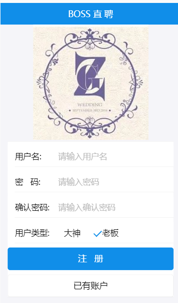
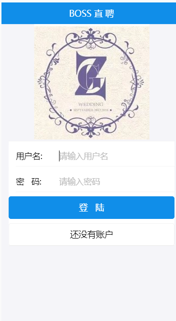
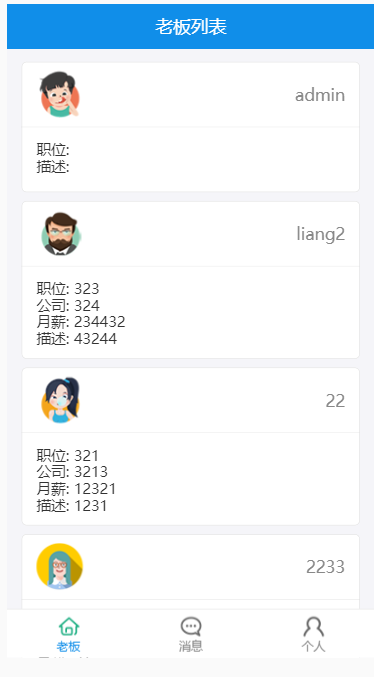
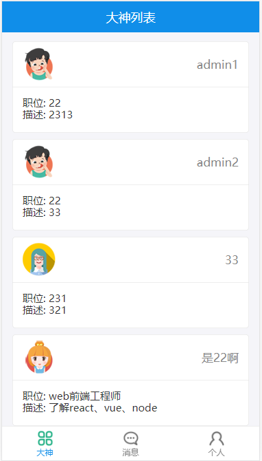
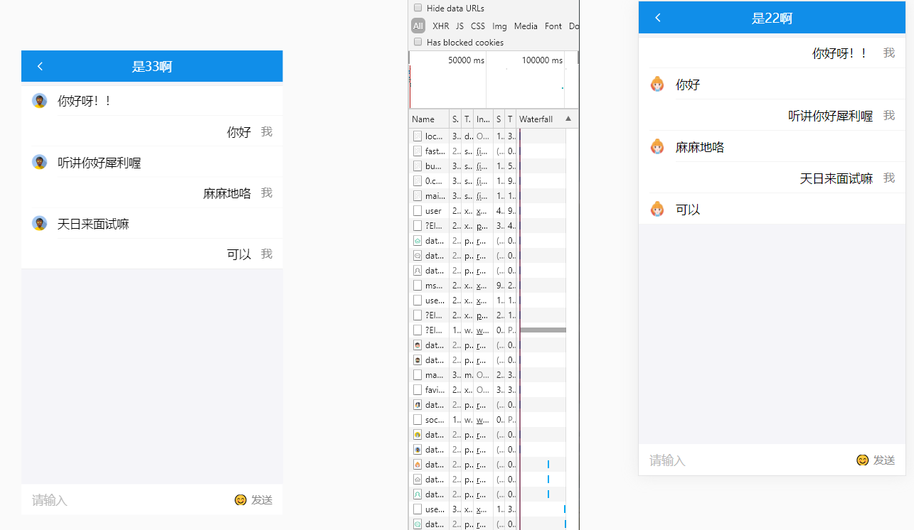

## 效果预览：

注册页面：

登录页面：

dasheng页面：

老板页面：

个人页面：

聊天页面：

## 技术栈：

前端：react、redux、react-router、es6、webpack
后台:Node + express + mongodb + socketIO
采用模块化、组件化、工程化的模式开发

## 运行说明

### 1. 准备

	1) 确保安装了node环境
	
	2) 确保安装了mongodb, 并启动了对应的服务

## 2. 启动后台应用

	1). 进入react_service
	2).cnpm start
	3). 执行命令: npm start

## 3. 启动前台应用并访问

	1). 进入react_client
	2).cnpm install
	3). 执行命令: npm start

## 做项目中遇到的问题：

- react Objects are not valid as a React child (found: object with keys {})

原因：虽然报错位置在actions中，但是实际上是在HTML中插入了对像，

在这次中不小心打多了个大括号，从而导致报错

- 问题：用require加载图片时，报GET http://localhost:3000/[object%20Module] 404 (Not Found)错误，

解决：require(`../../assets/images/${text}.png`).default,加上default即可。

- 注意websock前后端的版本号要一致

客户端用的是websocket.io-client

服务端用的是websocket.io
